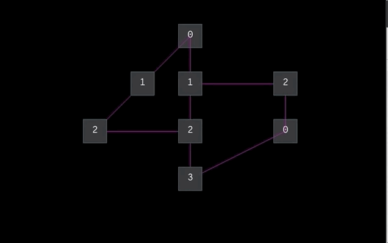

# Hive Helsinki: Lem_in
C — Getting deeper into algorithms.

## Challenge
Lem_in is essentially a graph and flow problem. Move x amount of "ants" Through a graph consisting of connected nodes. 

## Solution
We implemented the Edmonds-Karp algorithm, in which we find the shortest paths using breadth-first search while also allowing negative flow to get the optimal paths.

## Preview

## Useful reading and watching
[Dinic algorithm in Wikipedia](https://en.wikipedia.org/wiki/Dinic%27s_algorithm)\
[Article and some code on Ford-Fulkerson](https://sahebg.github.io/computersceince/Maximux-flow-ford-fulkarson-algorithm-c-program-example)\
[Another 42 student's article on Lem_in](https://medium.com/@jamierobertdawson/lem-in-finding-all-the-paths-and-deciding-which-are-worth-it-2503dffb893)\
[Adjacency matrix in Wikipedia](https://en.wikipedia.org/wiki/Adjacency_matrix)\
[Pretty good video on hashtables](https://www.youtube.com/watch?v=wg8hZxMRwcw)\
[Code of that video](https://github.com/engineer-man/youtube/tree/master/077)\
[Another 42 lem_in](https://git.42l.fr/amamy/Lem-in)\
[Edmonds-Karp theory in video](https://www.youtube.com/watch?v=RppuJYwlcI8&t=3s)
